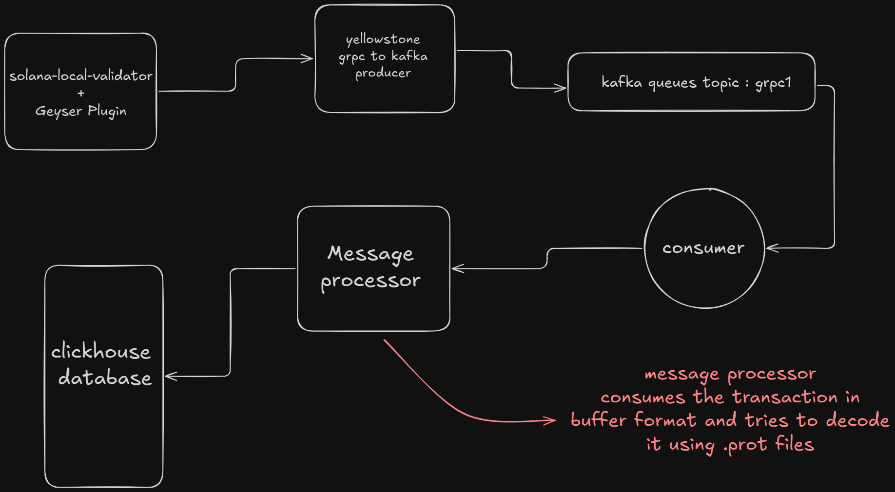

## Solana Local Validator Transaction/Slot Indexer

This repository indexes Solana slots and transactions from a local validator into ClickHouse via a Kafka pipeline. It is built around the Yellowstone gRPC Geyser stream.

### What this does
- **Ingest**: Subscribe to Solana Geyser updates (slots/blocks/transactions) exposed via Yellowstone gRPC.
- **Bridge**: A Rust service (`yellowstone-grpc-kafka`) forwards subscribed updates to a Kafka topic (`grpc1`).
- **Consume**: A Node.js/TypeScript backend (`solana-indexer-backend`) consumes Kafka messages, decodes them (protobuf/JSON/raw), and writes normalized records into ClickHouse (`blocks` table).

### Repo layout
- `solana-indexer-backend/`
  - `src/server.ts`: Starts the Express app and lifecycle; initializes ClickHouse, loads protobuf schema, starts Kafka consumer.
  - `src/kafka/consumer.ts`: Consumes Kafka topic `grpc1` from `localhost:9092`.
  - `src/services/processor.ts`: Decodes messages (prefers protobuf from `proto/solana-storage.proto`), persists to ClickHouse.
  - `src/protobuf/decoder.ts`: Loads and decodes Yellowstone/Solana protobuf types.
  - `proto/geyser.proto`, `proto/solana-storage.proto`: Protocol buffers used by Yellowstone gRPC Geyser.
- `yellowstone-grpc/`: Upstream Yellowstone gRPC sources (Rust). Useful for local builds/examples.
- `yellowstone-grpc-kafka/`: Rust bridge that subscribes to Geyser and publishes updates to Kafka (`grpc1`).
- `docker/`
  - `docker-compose.yml`: ClickHouse and Kafka services for local dev.
  - `clickhouse_data/`, `kafka_data/`: Local volumes for persistence.

### Prerequisites
- Docker + Docker Compose
- Node.js 18+ (or compatible) and pnpm/npm
- Rust toolchain (to build the Yellowstone Kafka bridge, if not using prebuilt binaries)
- Solana CLI and a local validator you control

### High-level architecture
1) `solana-test-validator` (your local node) produces Geyser events through the Yellowstone gRPC Geyser plugin.
2) `yellowstone-grpc-kafka` subscribes to the gRPC stream and publishes messages to Kafka topic `grpc1`.
3) `solana-indexer-backend` consumes `grpc1`, decodes messages using `proto/solana-storage.proto` and stores them as rows in ClickHouse table `blocks`.



### Getting started

1) Start infra (ClickHouse + Kafka)

```bash
cd docker
docker compose up -d
```

This exposes:
- ClickHouse HTTP at `http://localhost:8123`
- Kafka broker at `localhost:9092`

2) Run your Solana local validator with Yellowstone gRPC Geyser

You need a Geyser gRPC endpoint available at `127.0.0.1:10000` (default in examples). Set up one of the following:
- If you already have a validator with the Yellowstone gRPC Geyser plugin, ensure it is running and reachable at `127.0.0.1:10000`.
- Otherwise, follow Yellowstone gRPC docs to run the Geyser server against your local validator. As a starting point, see `yellowstone-grpc/README.md` for building and running the geyser service.

Note: This repository includes the upstream Yellowstone sources for convenience, but you may also use your own prebuilt geyser setup.

3) Start the Yellowstone gRPC → Kafka bridge

From the `yellowstone-grpc-kafka` directory you can run the bridge that subscribes to Geyser and publishes to Kafka. Update `config-kafka.json` as needed; by default it targets `127.0.0.1:10000` and Kafka at `localhost:9092` with topic `grpc1`.

```bash
cd yellowstone-grpc-kafka
cargo run --release --bin grpc-kafka -- ./config-kafka.json
```

Alternatively, use the provided Compose file in this directory if you want to containerize the bridge.

4) Run the indexer backend

```bash
cd solana-indexer-backend
npm install
npm run dev
```

On start, it will:
- Create the ClickHouse table `blocks` if it does not exist
- Load protobuf schemas from `proto/solana-storage.proto`
- Connect to Kafka and subscribe to `grpc1`

As Kafka messages arrive, they will be decoded and written to ClickHouse.

### ClickHouse schema
The backend creates a simple table for recorded messages:

```sql
CREATE TABLE IF NOT EXISTS blocks (
  timestamp DateTime64(3),
  topic String,
  partition UInt32,
  offset String,
  message_type String,
  decoded_data String,
  is_protobuf Bool,
  decode_success Bool
)
ENGINE = MergeTree()
ORDER BY (timestamp, topic, partition, offset);
```

Notes:
- `message_type` is one of `ConfirmedBlock`, `ConfirmedTransaction`, `Transaction`, `JSON`, `Raw`, or `Null`.
- `decoded_data` is JSON for protobuf/JSON messages; for raw, the backend stores multiple encodings.

### Configuration
- Kafka broker: `localhost:9092` (see `solana-indexer-backend/src/kafka/consumer.ts`)
- Topic: `grpc1`
- ClickHouse: `http://localhost:8123` (see `solana-indexer-backend/src/db/clickhouse.ts`)
- Protobuf: `proto/solana-storage.proto`, `proto/geyser.proto`
- Geyser gRPC endpoint (bridge): `127.0.0.1:10000` by default in examples

To change these, update the corresponding files or make them environment-driven as needed.

### Querying data
Example queries via ClickHouse HTTP:

```bash
curl 'http://localhost:8123/?query=SELECT%20count()%20FROM%20blocks'

curl 'http://localhost:8123/?query=SELECT%20message_type,%20count()%20FROM%20blocks%20GROUP%20BY%201%20ORDER%20BY%202%20DESC'
```

### Troubleshooting
- No rows in ClickHouse: Ensure the geyser gRPC server is reachable and the Kafka bridge is running; verify messages on topic `grpc1`.
- Decoding shows `JSON` or `Raw`: The message was not recognized as a known Solana protobuf type; verify the producer and proto versions match.
- Kafka/ClickHouse connection errors: Confirm Docker services are running and ports are reachable.

### Development notes
- The Express server is mainly a process host and graceful shutdown manager. There are no public HTTP routes by default.
- `src/indexer.ts` contains a direct gRPC client example for Yellowstone Geyser; the primary pipeline uses Kafka.

### License
Upstream Yellowstone repositories include their own licenses. This project code is provided as-is; see individual folders for licensing details.


